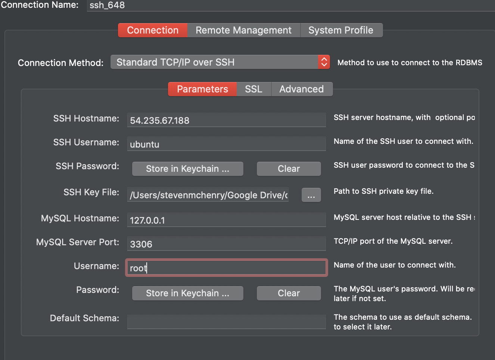

# Credentials Folder

## The purpose of this folder is to store all credentials needed to log into your server and databases. This is important for many reasons. But the two most important reasons is
    1. Grading , servers and databases will be logged into to check code and functionality of application. Not changes will be unless directed and coordinated with the team.
    2. Help. If a class TA or class CTO needs to help a team with an issue, this folder will help facilitate this giving the TA or CTO all needed info AND instructions for logging into your team's server. 

# Below is a list of items required. Missing items will causes points to be deducted from multiple milestone submissions.

1. Server URL or IP
    54.235.67.188
2. SSH username
    ubuntu
3. SSH password or key.
    .pem will be in credentials folder
4. Database URL or IP and port used.
    127.0.0.1:3306
5. Database username
    root
6. Database password
    passwordforteam3648
7. Database name (basically the name that contains all your tables)
    team3_648
8. Instructions on how to use the above information.
    1. open myql workbench
    2. in upper tab go to >Database >Connect to Database
    3. fill out information according to above or provided screenshot
        NOTE: you must type in the password instead of pasting it in
        
    4. attach the .pem file as the ssh key the is located in credential folder
    5. connect

# Most important things to Remember
## These values need to kept update to date throughout the semester.  
## <strong>Failure to do so will result it points be deducted from milestone submissions.</strong> 
## You may store the most of the above in this README.md file. DO NOT Store the SSH key or any keys in this README.md file.
